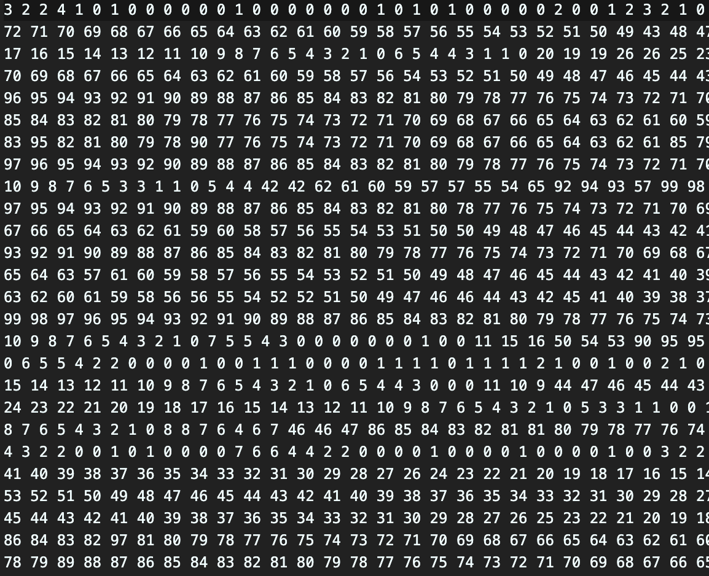

# Build
make
# Test
make test

# env
cpu :
Apple M2 칩
8코어 CPU(성능 코어 4개 및 효율 코어 4개)
효율 코어에는 128KB L1 명령 캐시, 64KB L1 데이터 캐시 및 공유 4MB L2 캐시

ram : 16GB

# comp
## block nested loop join
최대 램 사용량 : 약 5.68MB (part size 20000, partsupp size 1)
블록 사이즈 사용 이유 : cpu에 적재되는 캐시 미스가 증가하면서 메모리 접근 시간이 급격히 늘어나고, 성능이 크게 저하됩니다. 그렇기 때문에 약 4메가에 맞추고 실험을 하였으나, 후에 멀티 쓰레드에서의 비교를 위해 20000개로 늘림. 20000개로 설정한 이유는 멀티 쓰레드 쪽에 기재.

평균 시간:
user	190.62s
system	1.97s

## muti thread
최대 램 사용량 : 약 5.70 MB (part size 20000, partsupp size 100)

### 블록 크기 선정 사유
현재 효율 코어의 캐시 크기가 제한적이므로, 블록 크기가 너무 커질 경우 캐시 미스가 급격히 증가하여 성능이 저하됩니다.
결국 최대한 맞춰보면 14,000~15,000가 됨 그러나, 해당 사이즈는 큐에 쌀인 task가 너무 빨리 사라지는 결과를 낳음.

real    0m59.239s
user    4m52.832s
sys     0m56.408s

### 쓰레드 선정 사유
쓰레드 개수 : 10개 (메인 스레드 제외)
M2칩은 하이퍼스레딩을 지원하지 않기 때문에, 코어가 8개면, 8개의 쓰레드를 보유하게 됨. 그래서 이론상으로는 8개의 쓰레드만 사용하는 것이 좋다. 그러나 컨텍스트 스위칭을 최소화할 정도로 아주 약간 많은 스레드는 코어가 유휴 상태가 되는 것을 방지하기 때문에 10개로 설정했음. (아래에 테스트 결과)

1~6개 : 성능이 급속도로 증가함.
7개 : 메인 스레드 1개 + 7개로 총 
8개 ~ 9개 : 평균 46~48초로 스레드가 많아질수록 성능이 개선됨. (약간 많은 스레드는 코어가 유휴 상태가 되는 것을 방지하여 성능이 개선되는 것으로 추정)
10개~ 14개 : 평균 44~45초로 크게 개선되지 않는 것이 보임.
15개 : 평균 50초 이상으로 오히려 성능이 저하됨. (스레드가 너무 많아져 잦은 컨텍스트 스위칭으로 성능이 저하되는 양이 더 많은 것으로 추정)

real    0m59.239s
user    4m52.832s
sys     0m56.408s

평균 시간 :
real    0m44.317s
user    5m15.468s
sys     0m16.105s
